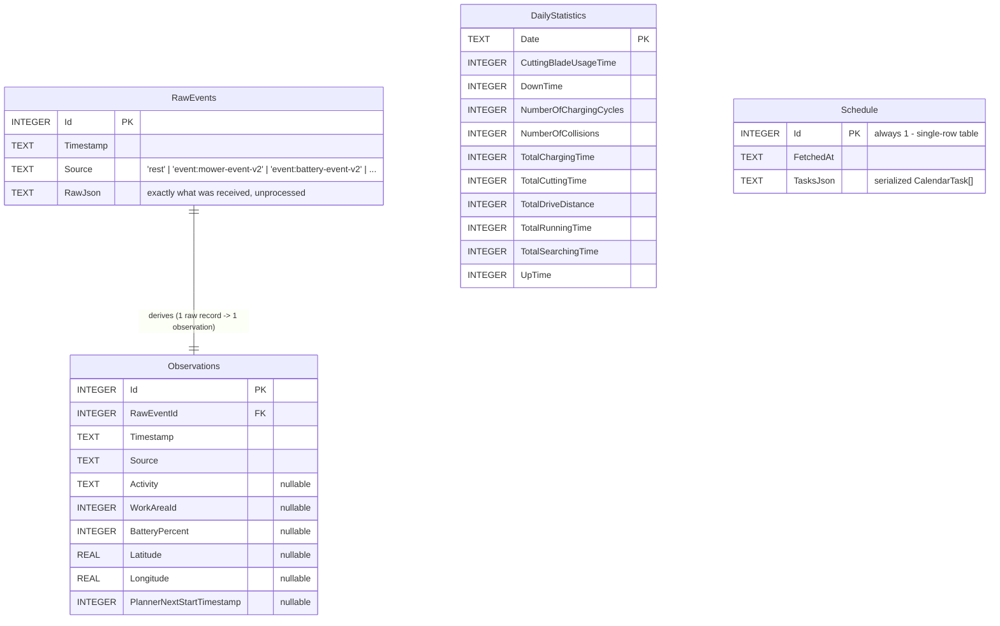
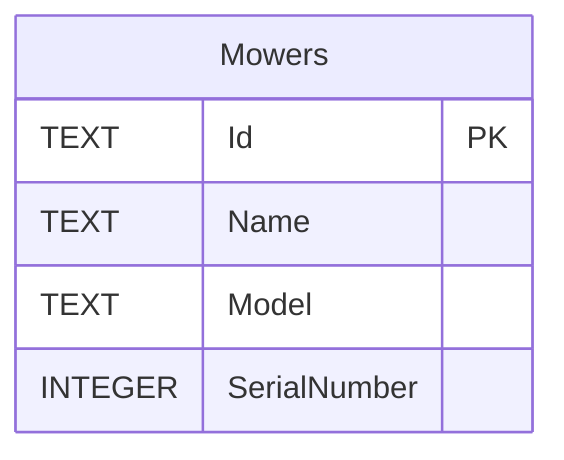

# Database schema (SQLite storage backend)

Part of the SQLite storage migration (feature branch, 2026-07-30) — see
`SESSION_LOG.md` for the full design discussion. Behind the same
`IMowerRepository`/`IMowerRegistry` interfaces the JSONL-backed
implementation already used (`AutomowerConsole.Core/MowerRepository.cs`,
`MowerRegistry.cs`), implemented by `SqliteMowerRepository`/
`SqliteMowerRegistry` (`AutomowerConsole.Core/SqliteMowerRepository.cs`).

## Layout: one database per mower, plus one shared database

- **`.data/mower-<name>.db`** — one per mower (`Storage.GetMowerDbPath`).
  No cross-mower queries are ever needed, and each mower already has its
  own independent writer process, so per-mower files avoid any write-lock
  contention between them even under SQLite's single-writer-at-a-time
  model. WAL mode is enabled on every connection, so a reader (the web app)
  and the one writer (that mower's tracker) never block each other.
- **`.data/common.db`** — shared across all mowers (`Storage.
  GetCommonDbPath`), just the mower registry today.

## Per-mower database

### `RawEvents` — the permanent, unprocessed source of truth

One row per REST poll response or WebSocket event received, storing the
payload exactly as it arrived — nothing derived, nothing dropped. Unifies
what were two separate JSONL files (`track-<mower>.jsonl`'s full REST
snapshots, `events-<mower>.jsonl`'s raw WebSocket messages) into one common
raw log covering both. Naturally non-duplicative: a REST response is
whatever size a full snapshot actually is, an event payload is whatever
size that event's own delta actually is — nothing is padded out or
repeated to match a common shape.

### `Observations` — a derived, sparse, query-friendly table

Built from `RawEvents`, not an independent source of truth. Only the
columns a given raw record actually carries get populated; everything else
stays `NULL` — a battery-only WebSocket event derives one small row with
just `BatteryPercent` filled in, not a repeat of activity/position/
everything else (the problem with a JSONL-style "every line is a full
snapshot" format under real event volume). Because it's fully derivable
from `RawEvents`, it can be **rebuilt from scratch** at any time
(`IMowerRepository.RebuildObservationsAsync`) if the extraction logic that
produces it turns out to have had a bug, or a newly-added field needs
backfilling into history that predates a code change — the raw data
underneath never has to change for that fix to be possible.

`GetHistory()` reconstructs the same fully-populated `PollRecord` shape
callers already used under the JSONL backend via a carry-forward scan over
`Observations`, ordered by `Timestamp`: each column keeps its last known
non-null value as the scan proceeds. `WorkAreaNames`/`LatestCalendarTasks`
(accumulator fields `GetHistory()` also returns) aren't in `Observations`
at all — re-derived by parsing every `Source = 'rest'` row's full
`RawEvents.RawJson`, the only source that ever carries `workAreas[]`/
`calendar`.

**Event-type field mappings** (`ObservationExtractor`), confirmed against
real captured WebSocket events, not guessed:

| Source | Populates |
|---|---|
| `rest` | every column (a REST response is always a complete snapshot) |
| `event:mower-event-v2` | `Activity`, `WorkAreaId` (from `attributes.mower.*`) |
| `event:battery-event-v2` | `BatteryPercent` (from `attributes.battery.batteryPercent`) |
| `event:position-event-v2` | `Latitude`, `Longitude` (from `attributes.position.*` — **a single point**, not an array like REST's `positions[]`; confirmed 2026-07-30, and actually better for GPS-coverage purposes than REST's array — no stale-buffer risk is even possible, since there's no buffer to begin with) |
| `event:planner-event-v2` | `PlannerNextStartTimestamp` (from `attributes.planner.nextStartTimestamp`) |
| `event:ready` (handshake) and every other event type (calendar/cuttingHeight/headlights/message) | nothing — no columns `Observations` tracks |

### `DailyStatistics` — one end-of-day lifetime-statistics snapshot per day

Same shape/purpose as the JSONL backend's `statistics-<mower>.jsonl`. The
`TrackingService`/`GroupIntoSeasons`/`AggregateDailyActivity` logic that
reads and aggregates this is already pure and backend-agnostic — unchanged
by this migration.

### `Schedule` — single-row cached calendar

Same as the JSONL backend's `schedule-<mower>.json`: the mower's calendar
tasks (as JSON) plus when they were last fetched, refreshed on every REST
poll.

## Common database

Replaces `mowers.json` — the cached mower catalog (`list`'s output),
resolved by name/id/index throughout the CLI and web app via `MowerService`.

## Why not one database for everything

Considered and rejected — see `SESSION_LOG.md`'s design discussion. The
short version: no query ever needs to join across mowers, each mower
already has its own independent writer process (the `track`/hybrid-event
daemon), and SQLite is single-writer-at-a-time per file — splitting by
mower turns a potential write-lock contention problem into a non-issue for
free, at the cost of one extra `CREATE TABLE IF NOT EXISTS` block per
mower instead of one shared schema (a trivial cost at 3 mowers).
